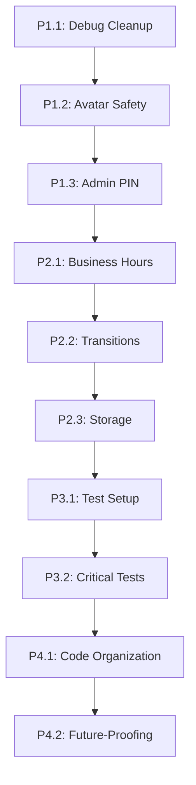

# 🚀 FoodRunner App Implementation Roadmap

**Created:** September 21, 2025  
**Branch:** `feature/radical-adjustments`  
**Safe Rollback:** `v1.0-stable-working` tag

---

## 📋 **Executive Summary**

This roadmap transforms the FoodRunner app from "working" to "production-ready" through 4 strategic phases. Each phase builds upon the previous, ensuring stability while making radical improvements.

**Total Estimated Timeline:** 8-12 hours of focused development  
**Risk Level:** Low (safe rollback available)  
**Impact:** High (security, stability, maintainability)

---

## 🏗️ **PHASE 1: FOUNDATION & SAFETY** 
*Estimated Time: 2-3 hours*  
*Priority: CRITICAL - Production Safety*

### **Goal:** Eliminate production risks and crashes

### **P1.1: Debug Print Cleanup** ⚡ *[30 minutes]*
**GPT-5 Issue #6**
- **Why First:** Quick win, immediate production benefit
- **Risk:** Very Low
- **Impact:** Performance, security (no debug leaks)

**Implementation:**
1. Create `lib/utils/debug_log.dart` with conditional logging
2. Replace ~50 `print()` statements with `d()` helper
3. Verify no debug output in release builds

**Acceptance Criteria:**
- [ ] No `print()` statements remain in codebase
- [ ] Debug helper only logs in debug mode
- [ ] Release build produces no debug output

---

### **P1.2: Avatar Crash Prevention** 🛡️ *[45 minutes]*
**GPT-5 Issue #10**
- **Why Second:** Prevents user-facing crashes
- **Risk:** Low
- **Impact:** User experience, app stability

**Implementation:**
1. Add default avatar asset to `assets/avatars/default_avatar.png`
2. Wrap `FileImage` usage with error handling
3. Fallback to default avatar on file errors
4. Test with missing/corrupted avatar files

**Acceptance Criteria:**
- [ ] App never crashes from missing avatar files
- [ ] Default avatar displays when custom avatar unavailable
- [ ] Graceful error handling with user feedback

---

### **P1.3: Admin PIN Security Fix** 🔐 *[90 minutes]*
**GPT-5 Issue #1**
- **Why Third:** Security vulnerability, but needs careful testing
- **Risk:** Medium (affects admin functions)
- **Impact:** Security, customization

**Implementation:**
1. Remove hardcoded PIN constant from `app_state.dart`
2. Add PIN storage to `lib/storage.dart` with default "5520"
3. Create PIN change UI in admin screen
4. Update all PIN verification calls
5. Add PIN validation (4 digits, not empty)

**Acceptance Criteria:**
- [ ] No hardcoded PIN in source code
- [ ] Admin can change PIN through UI
- [ ] PIN persists across app restarts
- [ ] All admin functions work with new PIN system

---

## 🏛️ **PHASE 2: ARCHITECTURE & RELIABILITY**
*Estimated Time: 3-4 hours*  
*Priority: HIGH - System Stability*

### **Goal:** Fix core architecture issues and prevent system failures

### **P2.1: Business Hours Logic Fix** ⏰ *[90 minutes]*
**GPT-5 Issue #8**
- **Why First:** Builds on our recent DateTimeRange fix
- **Risk:** Medium (affects core business logic)
- **Impact:** Overnight operations work correctly

**Implementation:**
1. Extend `isOpenNow()` for overnight hours (e.g., 17:00-01:00)
2. Add validation for business hours configuration
3. Write comprehensive unit tests for edge cases
4. Test with real overnight scenarios

**Acceptance Criteria:**
- [ ] Overnight business hours work correctly
- [ ] Edge cases (DST, midnight) handled properly
- [ ] Unit tests cover all scenarios
- [ ] Business logic is bulletproof

---

### **P2.2: Transition Logic Hardening** 🔄 *[120 minutes]*
**GPT-5 Issue #5**
- **Why Second:** Critical for shift operations
- **Risk:** High (affects data integrity)
- **Impact:** Reliable shift transitions, no data loss

**Implementation:**
1. Add transition checkpoint persistence
2. Implement idempotent transition guards
3. Add clock injection for testability
4. Implement recovery from interrupted transitions
5. Add comprehensive logging and monitoring

**Acceptance Criteria:**
- [ ] Transitions are idempotent (can't run twice)
- [ ] System recovers from interrupted transitions
- [ ] Clock is mockable for testing
- [ ] Transition state persisted and validated

---

### **P2.3: Storage Architecture Unification** 📦 *[90 minutes]*
**GPT-5 Issue #4**
- **Why Third:** Foundation for reliable data
- **Risk:** Medium (data migration required)
- **Impact:** Consistent data storage, no more lost settings

**Implementation:**
1. Extend Storage boxes for all preferences
2. Migrate raw SharedPreferences to Storage wrapper
3. Add migration logic for existing data
4. Implement data validation and recovery
5. Add storage health checks

**Acceptance Criteria:**
- [ ] All data goes through Storage wrapper
- [ ] Migration preserves existing user data
- [ ] No more raw SharedPreferences usage
- [ ] Storage is self-healing

---

## 🧪 **PHASE 3: TESTING & VALIDATION**
*Estimated Time: 2-3 hours*  
*Priority: MEDIUM - Development Quality*

### **Goal:** Establish reliable testing foundation

### **P3.1: Test Infrastructure Setup** 🔬 *[90 minutes]*
**GPT-5 Issue #3**
- **Why First:** Foundation for all other testing
- **Risk:** Low (doesn't affect production)
- **Impact:** Development confidence, regression prevention

**Implementation:**
1. Fix package imports in test files
2. Add clock dependency injection to AppState
3. Create test helpers and mocks
4. Set up test data builders
5. Configure CI/test automation

**Acceptance Criteria:**
- [ ] Tests run without import errors
- [ ] Clock is mockable in all time-dependent code
- [ ] Test helpers are reusable
- [ ] Tests are fast and reliable

---

### **P3.2: Critical Path Testing** ✅ *[90 minutes]*
**GPT-5 Issue #3 continued**
- **Why Second:** Test the most important features
- **Risk:** Low
- **Impact:** Catch regressions early

**Implementation:**
1. Write transition logic tests (lunch→dinner, preservations)
2. Write business hours tests (overnight, edge cases)
3. Write storage/persistence tests
4. Write admin PIN tests
5. Add integration tests for critical workflows

**Acceptance Criteria:**
- [ ] All transition scenarios tested
- [ ] Business hours edge cases covered
- [ ] Storage operations tested
- [ ] Admin functions tested
- [ ] Integration tests pass

---

## 🎨 **PHASE 4: POLISH & OPTIMIZATION**
*Estimated Time: 1-2 hours*  
*Priority: LOW - Code Quality*

### **Goal:** Clean up codebase and improve maintainability

### **P4.1: Code Organization** 📁 *[45 minutes]*
**GPT-5 Issues #2, #7**
- **Why Together:** Related cleanup tasks
- **Risk:** Very Low
- **Impact:** Developer experience, maintainability

**Implementation:**
1. Remove dead code (`_backup_foodrunning/`, unused examples)
2. Move `StationType` to proper models directory
3. Consolidate duplicate screen files
4. Update all imports and references
5. Run static analysis and fix warnings

**Acceptance Criteria:**
- [ ] No dead code remains
- [ ] Models are properly organized
- [ ] No duplicate implementations
- [ ] Static analysis passes clean

---

### **P4.2: Future-Proofing** 🔮 *[30 minutes]*
**GPT-5 Issue #9**
- **Why Last:** Nice to have, not critical
- **Risk:** Very Low
- **Impact:** Future migration support

**Implementation:**
1. Add schema versioning to Storage
2. Create migration framework stub
3. Document schema evolution process
4. Add version logging and monitoring

**Acceptance Criteria:**
- [ ] Schema version tracked
- [ ] Migration framework ready
- [ ] Documentation updated
- [ ] Version monitoring in place

---

## 🎯 **EXECUTION STRATEGY**

### **Development Approach:**
1. **One Phase at a Time:** Complete entire phase before moving to next
2. **Incremental Commits:** Small, atomic commits within each task
3. **Testing First:** Write/fix tests before implementing features
4. **Safety Checks:** Test thoroughly before moving to next phase

### **Risk Mitigation:**
- Each phase has its own feature branch
- Regular commits with descriptive messages
- Rollback plan documented for each change
- Production testing after each phase

### **Success Metrics:**
- **Phase 1:** Zero production crashes, clean release builds
- **Phase 2:** Bulletproof business logic, reliable transitions
- **Phase 3:** >80% test coverage on critical paths
- **Phase 4:** Clean codebase, maintainable architecture

### **Emergency Procedures:**
```bash
# If anything breaks, immediate rollback:
git checkout v1.0-stable-working

# Or reset current branch:
git reset --hard v1.0-stable-working

# Start fresh:
git checkout -b feature/implementation-restart v1.0-stable-working
```

---

## 📊 **DEPENDENCIES & SEQUENCING**



**Critical Path:** P1.1 → P1.3 → P2.2 → P3.1  
**Parallel Opportunities:** P4.1 can be done anytime after P1.3

---

## 🚀 **READY TO BEGIN**

**Current Status:** ✅ Ready  
**Next Action:** Execute Phase 1.1 (Debug Print Cleanup)  
**Estimated Completion:** 4-6 days of focused work

**Commands to start:**
```bash
# Verify we're on the right branch
git status  # Should show: feature/radical-adjustments

# Begin Phase 1.1
# (Ready for your command!)
```

---

*This roadmap transforms technical debt into technical excellence while maintaining production stability. Each phase delivers immediate value while building toward the ultimate goal of a bulletproof, maintainable application.*